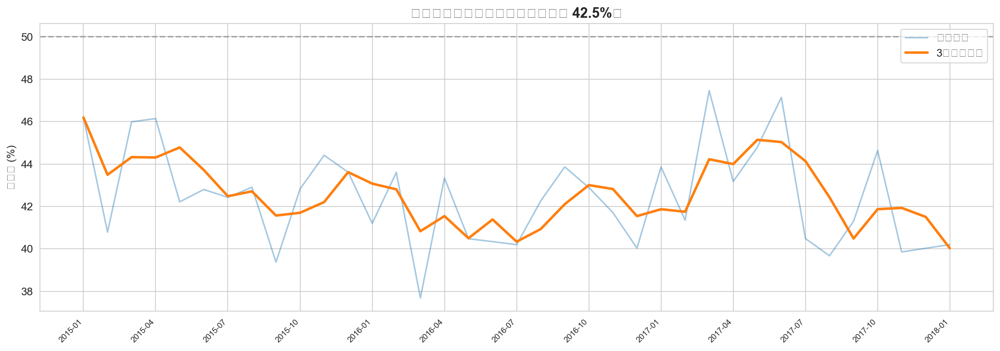
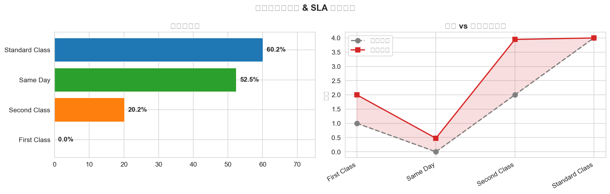
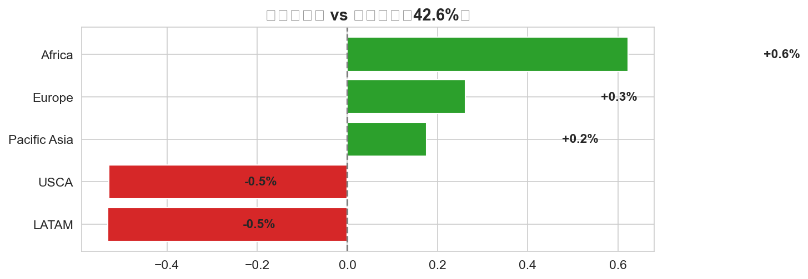
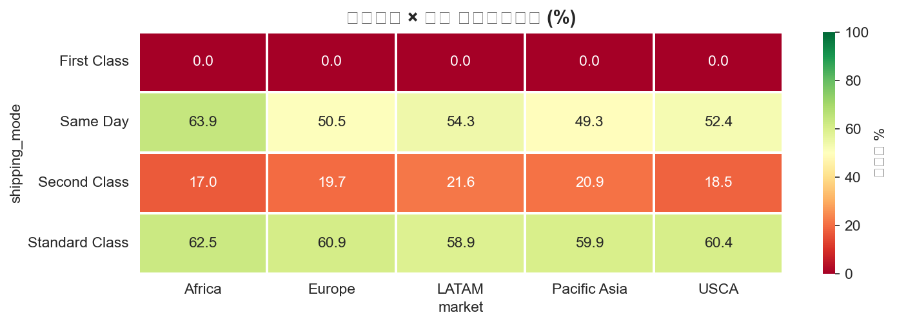
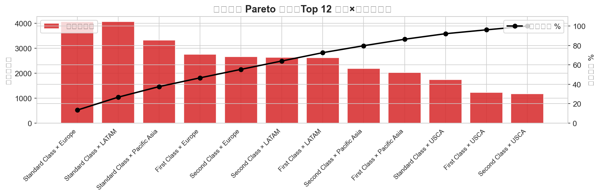
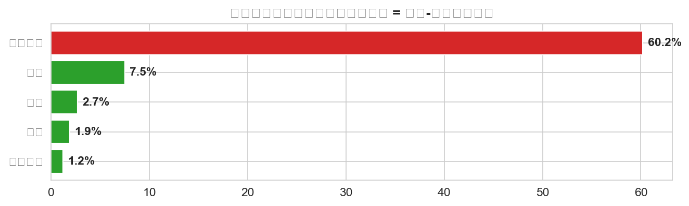

# 供应链运营分析平台（SQL + Streamlit）

[](https://www.python.org/)
[](https://www.sqlite.org/)
[](https://streamlit.io/)
[](LICENSE)

基于 **DataCo 全球供应链数据集（180K+ 条订单，53 个字段）** 构建的端到端运营分析平台。覆盖数据清洗 → 星型建模 → SQL 分析 → 交互式仪表板的完整链路。

**🔗 在线仪表板**: [Streamlit App](https://supply-chain-operations-analytics.streamlit.app) *(待部署)*  
**📂 GitHub**: https://github.com/lingtao-meng/supply-chain-operations-analytics

---

## ✨ 核心特性

- **自动初始化管道**: App 启动时自动从 Kaggle 下载数据 → 清洗 → 建库，零手工配置
- **5 页交互仪表板**: 交付绩效 / 运输成本 / 品类市场 / 延迟根因 / 数据质量
- **自动业务洞察**: 基于筛选数据实时生成 5 维度文本洞察 + 行动建议
- **延迟因素关联分析**: 量化运输方式/市场/星期/季度/部门对准时率的影响强度
- **10 条复杂 SQL**: 窗口函数 / CTE / NTILE / 同比环比 / Pareto 分析
- **数据导出**: 一键下载筛选后数据为 CSV
- **Jupyter 深度报告**: 季节性检验 / 相关性分析 / 优化建议与 ROI 估算

---

## 🎯 回答的核心业务问题

- 哪些运输方式的准时率最低？延迟集中在哪些市场和品类？
- 各市场区域的交付绩效差距有多大？趋势是在恶化还是改善？
- 延迟订单造成了多少收入风险？根因在运输、区域还是品类？
- 月度准时率是否有季节性波动？同比趋势如何？

---

## 📐 项目架构

```
DataCo CSV (180K, 53字段)
        │
        ▼
Python 数据清洗 (pandas)
  ├── 删除 PII + 泄露特征 (12列)
  ├── 缺失值处理 + 类型转换
  ├── 衍生特征: 延迟天数 / 准时标记 / 延迟等级 / 日期维度
  └── 输出: orders_cleaned.csv + 4 张维度表 CSV
        │
        ▼
SQLite 星型模型
  ├── dim_date       (日期维度 — 65K 行)
  ├── dim_customer   (客户/市场维度 — 20K 行)
  ├── dim_product    (产品/品类维度 — 118 行)
  ├── dim_shipping   (运输方式维度 — 4 种)
  └── fact_orders    (订单事实表 — 180K 行, 行级=订单×商品项)
        │
        ▼
SQL 分析层 (10 条复杂查询)
  ├── 窗口函数 (滚动均值 / 同比 / 环比)
  ├── CTE 多层聚合 + NTILE 分位数排名
  └── 条件聚合 & Pareto 延迟贡献度分析
        │
        ▼
Streamlit 交互仪表板 (5 页 + 自动洞察)
  ├── 📊 交付绩效 Overview + 自动业务洞察
  ├── 🚚 运输与物流成本
  ├── 🏷️ 品类 & 市场洞察
  ├── 🔍 延迟根因 + 因素关联分析
  └── 📐 数据概览 & 质量报告
```

---

## 📁 项目结构

```
supply-chain-operations-analytics/
├── app/
│   └── app.py                    # Streamlit 5页交互仪表板
├── notebooks/
│   └── supply_chain_deep_analysis.ipynb  # Jupyter 深度分析报告
├── python/
│   ├── 01_data_cleaning.py       # 数据清洗 + 特征工程
│   └── 02_load_to_db.py         # 星型模型入库
├── sql/
│   ├── 01_create_schema.sql      # DDL: 5维1事实 + 6索引
│   └── 02_analytics_queries.sql  # 10条核心分析查询
├── tests/
│   └── test_sql_queries.py       # SQL 查询自动化测试
├── images/
│   └── *.png                      # 仪表板截图
├── powerbi/
│   └── DAX_MEASURES.md           # Power BI DAX度量参考 (Mac备选)
├── data/
│   └── supply_chain.db           # SQLite数据库 (运行后生成)
├── requirements.txt
├── LICENSE
└── README.md
```

---

## 🚀 快速开始

```bash
# 1. 克隆
git clone https://github.com/lingtao-meng/supply-chain-operations-analytics.git
cd supply-chain-operations-analytics

# 2. 安装依赖
pip install -r requirements.txt

# 3. 数据清洗
#    (修改 python/01_data_cleaning.py 中的 INPUT_PATH 指向 DataCo CSV)
python python/01_data_cleaning.py

# 4. 构建数据库
python python/02_load_to_db.py

# 5. 启动仪表板
streamlit run app/app.py
```

> **数据源**: [DataCo Supply Chain Dataset](https://www.kaggle.com/datasets/evilspirit05/datasupplychain) on Kaggle (93MB, 180,519 条订单记录).

---

## 📊 10 条核心 SQL 分析

| # | 分析主题 | SQL 技术 | 业务价值 |
|---|---------|---------|---------|
| Q1 | 月度准时率 + 滚动 3 月均值 | `AVG OVER (ROWS)`, `LAG` | 趋势监控 + 环比预警 |
| Q2 | 运输方式准时率 & 排名 | `RANK`, `CASE WHEN` | 承运商绩效对比 |
| Q3 | 延迟根因: 运输 × 市场交叉 | `GROUP BY`, `HAVING` | 定位最差组合 |
| Q4 | 品类月度需求 & 同比变化 | `LAG(..., 12)`, `PARTITION BY` | 季节性 + 年度对比 |
| Q5 | 延迟天数分级统计 | `SUM OVER ()`, 条件聚合 | 延迟严重度分布 |
| Q6 | 高风险订单画像 | 多表 `JOIN` + 多条件筛选 | 精准定位问题订单 |
| Q7 | 品类-市场准时率分位数 | `NTILE(4)`, `RANK OVER` | 相对绩效排名 |
| Q8 | 周度订单量 & 延迟趋势 | `strftime`, 时序聚合 | 周级季节性 |
| Q9 | 产品延迟 Pareto 分析 | `SUM OVER (ORDER BY DESC)` | 80/20 聚焦 |
| Q10 | 全局 KPI 汇总 | `COUNT DISTINCT`, 多维度 | 一张表看清全貌 |

---

## 📸 仪表板预览

| 交付绩效 | 运输分析 |
|:---:|:---:|
|  |  |
| **市场差距** | **运输×市场热力图** |
|  |  |
| **延迟 Pareto** | **因素关联强度** |
|  |  |

---

## 📈 关键发现

| 洞察 | 数据 | 业务含义 |
|------|------|---------|
| Standard Class 准时率最高 | 60.2% | 计划4天实际4天，最稳定 |
| First Class 准时率 0% | n=9,307 | 承诺1天但从未兑现，平均实需2天 → SLA 不合理 |
| Second Class 准时率仅 20.2% | n=11,655 | 承诺2天平均实需3.9天 → 严重超估 |
| 超半数延迟在 1-3 天 | 53.7% | 轻微延迟是主要矛盾，流程优化可见效 |
| LATAM 市场准时率最低 | 低于全球均值 | 物流基础设施瓶颈 |

---

## 🧪 测试

```bash
# 验证全部 10 条 SQL 查询
python tests/test_sql_queries.py
```

---

## 🛠 技术栈

| 层 | 技术 |
|---|------|
| 数据清洗 | Python (pandas, numpy) |
| 数据库 | SQLite3 |
| SQL 分析 | 窗口函数 / CTE / 子查询 / 聚合 / 排名函数 |
| 可视化 | Streamlit + Plotly |
| 深度分析 | Jupyter Notebook |
| 测试 | Python unittest-style SQL validation |

| 层 | 技术 |
|---|------|
| 数据清洗 | Python (pandas, numpy) |
| 数据库 | SQLite3 |
| SQL 分析 | 窗口函数 / CTE / 子查询 / 聚合 / 排名函数 |
| 可视化 | Streamlit + Plotly |

---

## 📄 License

MIT — 自由使用、修改和分享。
